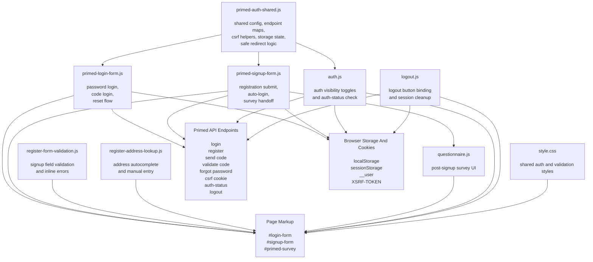

# Primed Login Form

Standalone frontend authentication assets for Primed Clinic. This repository contains the current login, signup, logout, auth-state, and questionnaire scripts used in a plain HTML or Webflow-style setup, plus older prototypes kept under `deprecated/`.

## Folder Structure

```text
primed-login-form/
|-- .github/
|   `-- workflows/
|       `-- static.yml
|-- deprecated/
|   |-- index.html
|   |-- login-form.js
|   |-- register-form.js
|   |-- register-form-v-2.js
|   |-- signup-embed.js
|   |-- signup-embed-1.js
|   |-- signup-embed-1.tsx
|   |-- survey-questions.js
|   `-- survey-widget.js
|-- auth.js
|-- logout.js
|-- primed-auth-shared.js
|-- primed-login-form.js
|-- primed-signup-form.js
|-- questionnaire.js
|-- register-address-lookup.js
|-- register-form-validation.js
|-- style.css
|-- LICENSE
`-- README.md
```

## Active Files

| File | Purpose |
| --- | --- |
| `primed-auth-shared.js` | Shared config, endpoint resolution, CSRF handling, localStorage/sessionStorage state, referral parsing, safe redirects, and shared helpers used by the current auth flow |
| `primed-login-form.js` | Current login controller for password login, one-time code login, and password reset UI inside the existing page markup |
| `primed-signup-form.js` | Current signup controller, including referral code prefill, registration submit, auto-login, and handoff into the questionnaire view |
| `questionnaire.js` | Bundled questionnaire experience shown after signup; includes its own styles and survey UI logic |
| `register-address-lookup.js` | Address autocomplete/manual-entry helper for the registration form |
| `register-form-validation.js` | Client-side validation helpers for signup fields, including email, Australian mobile, address, and password rules |
| `auth.js` | Reads the local `__user` cookie, toggles `[data-auth]` visibility, and optionally confirms session validity against an `/auth-status` endpoint |
| `logout.js` | Binds click handlers to `[data-logout-button="true"]`, calls the logout endpoint, clears the local session cookie, and redirects |
| `style.css` | Shared styling for auth toggles, hidden panels, and validation/error states |

## Dependency Diagram



Load-order summary:

- `primed-auth-shared.js` must load before `primed-login-form.js` and `primed-signup-form.js`
- `register-form-validation.js` and `register-address-lookup.js` enhance the signup page markup
- `questionnaire.js` is independent at file level, but is revealed by the signup flow
- `auth.js` and `logout.js` can run alongside the main auth controllers
- `style.css` supports the page markup and validation/auth UI states

## Deprecated Files

Everything inside `deprecated/` is legacy and not part of the current recommended integration.

These files show earlier iterations of the auth and survey widgets:

- `deprecated/login-form.js`
- `deprecated/register-form.js`
- `deprecated/register-form-v-2.js`
- `deprecated/signup-embed.js`
- `deprecated/signup-embed-1.js`
- `deprecated/signup-embed-1.tsx`
- `deprecated/survey-questions.js`
- `deprecated/survey-widget.js`
- `deprecated/index.html`

The current codebase has moved away from those standalone custom elements and now relies on the shared controller setup in `primed-auth-shared.js`, `primed-login-form.js`, and `primed-signup-form.js`.

## How The Current Flow Works

1. `primed-auth-shared.js` boots first and exposes `window.PrimedAuthShared`.
2. `primed-login-form.js` and `primed-signup-form.js` attach behavior to the existing page containers and forms.
3. Shared page state determines whether the user sees the login view, signup view, or survey view.
4. Signup can auto-login the user and then reveal `#primed-survey`.
5. `questionnaire.js` powers the post-signup questionnaire experience.
6. `auth.js` can independently show or hide page elements marked with `data-auth="in"` and `data-auth="out"`.
7. `logout.js` binds logout buttons anywhere on the page.

## Required Page Structure

The current scripts expect existing markup on the page rather than a single custom element tag.

Important container IDs:

- `#login-form`
- `#signup-form`
- `#primed-survey`

Important login form selectors used by `primed-login-form.js` include:

- `form.login_input-form`
- `#login-form_email`
- `#login-form_password`

Important signup form selectors used by `primed-signup-form.js` include:

- `form.signup_input-form`
- `#First-Name`
- `#Last-Name`
- `#Email`
- `#Phone`
- `#Password`
- `#Confirm-Password`
- `#register-address`
- `#streetNumber`
- `#streetName`
- `#suburb`
- `#state`
- `#postcode`

If those IDs or classes change in the page markup, the scripts will need to be updated to match.

## Script Load Order

Load the assets in this order so dependencies are available before the controllers run:

```html
<link rel="stylesheet" href="/style.css">

<script src="/primed-auth-shared.js" defer></script>
<script src="/register-form-validation.js" defer></script>
<script src="/register-address-lookup.js" defer></script>
<script src="/primed-login-form.js" defer></script>
<script src="/primed-signup-form.js" defer></script>
<script src="/questionnaire.js" defer></script>
<script src="/auth.js" defer></script>
<script src="/logout.js" defer></script>
```

## Auth And API Behaviour

### Environment mapping

Most endpoints are selected from hostname maps inside `primed-auth-shared.js`. At the moment the live mappings target:

- `dev-frontend.primedclinic.com.au`
- `www.primedclinic.com.au`

Configured endpoint groups include:

- login
- send code
- validate code
- forgot password
- register guest
- Sanctum CSRF cookie
- login redirect

`auth.js` and `logout.js` keep their own hostname maps for `auth-status` and logout respectively.

### CSRF

The current flow uses Laravel Sanctum's CSRF-cookie pattern. Before write requests, the scripts fetch the configured `/sanctum/csrf-cookie` endpoint when the cached CSRF cookie has expired.

### Session state

After login, the frontend creates a local `__user` cookie. `auth.js` uses that cookie for fast client-side visibility changes, then optionally verifies the server session with `/auth-status`.

### Redirect safety

Shared redirect helpers only allow redirects to approved Primed hosts defined in `primed-auth-shared.js`.

## Supporting Utilities

### `register-form-validation.js`

Adds inline validation styling and messages for:

- required fields
- email format
- Australian mobile numbers
- street number and street name
- suburb, state, and postcode
- password strength

### `register-address-lookup.js`

Handles address-detail population and manual-entry fallback for the signup form. It expects the address input to exist and manages these fields:

- `streetNumber`
- `streetName`
- `suburb`
- `state`
- `postcode`

## GitHub Pages Workflow

`.github/workflows/static.yml` publishes the repository as a static site through GitHub Pages on pushes to `main`.

The workflow:

1. Checks out the repo.
2. Configures GitHub Pages.
3. Uploads the repository root as the Pages artifact.
4. Deploys it.

## Notes

- There is currently no root-level `index.html` checked into this repository.
- `questionnaire.js` is a large bundled build artifact rather than hand-authored source.
- The README previously described the older `login-form.js` and `register-form.js` flow; those files now live only in `deprecated/`.
